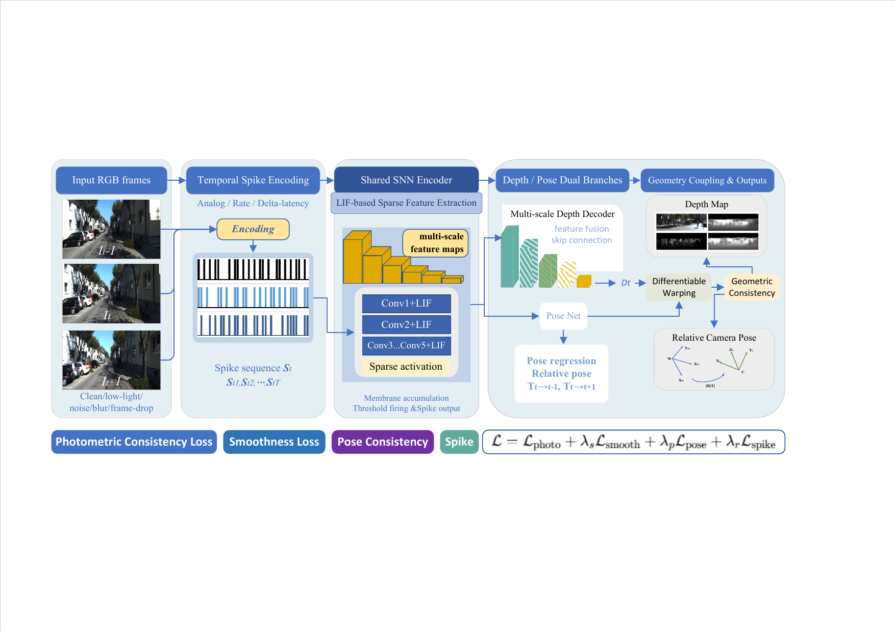

# RGB Spatiotemporal Spike Encoding and Hybrid Depth-Pose Perception toward Resource-Aware Visual Front-Ends

This repository contains the main implementation of our paper on RGB spatiotemporal spike encoding and hybrid depth-pose perception for resource-aware visual front-ends. The project studies how conventional RGB video can be converted into spike-based temporal representations and then used for monocular depth perception and geometry-aware front-end modeling.



We focus on a practical visual front-end design that combines RGB-to-spike temporal encoding, an SNN-based depth branch, and a hybrid pose pathway, together with sparse execution analysis for studying the trade-off among geometry quality, spike sparsity, and runtime cost.

The released code is organized into two complementary branches:

- `depth_branch/`: the depth learning pipeline, including ANN depth training and SNN depth fine-tuning.
- `geometry_branch/`: the geometry front-end pipeline, including self-supervised depth-pose training, VO evaluation, geometry backend evaluation, and latency benchmarking.

The central idea is to combine:

- RGB-to-spike temporal encoding from standard frame-based input;
- an SNN-based depth branch for spike-driven geometric representation learning;
- a hybrid depth-pose front-end in which depth is modeled in the spike domain while pose estimation remains stable and practical;
- sparse execution analysis for studying the trade-off among geometry quality, spike sparsity, and runtime cost.

This public release is intentionally cleaned for reproducibility and readability:

- core model definitions are kept;
- main training and evaluation scripts are kept;
- dataset preparation helpers are kept;
- private experiment outputs, reviewer-only utilities, and local drafting files are excluded.

## Overview

At a high level, the framework follows the pipeline below:

1. Consecutive RGB frames are converted into temporal spike representations through configurable encoding schemes such as analog, rate, and delta-latency variants.
2. The spike sequence is processed by a shared SNN encoder with LIF-based temporal dynamics.
3. The encoded representation is used by a depth branch and a geometry branch.
4. The system is trained with photometric consistency, smoothness, and pose-related geometric constraints.
5. Sparse execution statistics are recorded to analyze deployment-oriented operating points.

Compared with a conventional dense ANN front-end, this repository is intended to expose how spike-based temporal encoding can be integrated into a practical geometric perception pipeline rather than to present a purely neuromorphic end-to-end system.

## Repository Layout

```text
.
├── depth_branch/
│   ├── common.py
│   ├── make_kitti_selection_lists.py
│   ├── models.py
│   ├── train_ann_depth.py
│   ├── train_snn_depth.py
│   └── README.md
├── geometry_branch/
│   ├── benchmark_snn_frontends.py
│   ├── common.py
│   ├── compare_frontend_vo.py
│   ├── eval_snn_geometry_backend.py
│   ├── eval_snn_vo_ate.py
│   ├── make_kitti_sfm_triplets.py
│   ├── models.py
│   ├── run_lif_spike_mainline.py
│   ├── sfm_common.py
│   ├── slam_backend.py
│   ├── train_snn_sfm_kitti.py
│   └── README.md
├── docs/
│   └── DATA_PREPARATION.md
├── .gitignore
├── LICENSE
└── requirements.txt
```

## Environment

- Python `>=3.8`
- PyTorch with CUDA is recommended for training

Install dependencies:

```bash
pip install -r requirements.txt
```

## Quick Start

### 1. Prepare datasets

See [DATA_PREPARATION.md](docs/DATA_PREPARATION.md).

### 2. Depth branch

See [depth_branch/README.md](depth_branch/README.md).

### 3. Geometry branch

See [geometry_branch/README.md](geometry_branch/README.md).

## Notes

- Pretrained checkpoints are not included in this release.
- Dataset files are not included in this release.
- Paths in the training scripts are configurable through command-line arguments.
- The geometry branch currently supports ANN-initialized and SNN fine-tuned front-end training on KITTI odometry sequences.

## Main Components

- `depth_branch/models.py`: ANN/SNN depth models and shared modules for the depth branch.
- `geometry_branch/models.py`: SNN front-end model, temporal encoding, sparse execution logic, and hybrid depth-pose design.
- `geometry_branch/train_snn_sfm_kitti.py`: main self-supervised geometry training entry.
- `geometry_branch/eval_snn_vo_ate.py`: VO trajectory and ATE evaluation.
- `geometry_branch/eval_snn_geometry_backend.py`: backend-oriented geometric consistency evaluation.
- `geometry_branch/benchmark_snn_frontends.py`: deployment-oriented latency and memory benchmarking.

The depth and geometry branches intentionally use different depth heads in this release: `depth_branch/` keeps a Monodepth2-style skip decoder for depth-focused experiments, while `geometry_branch/` uses a lighter single-scale decoder for the front-end SfM pipeline.

## Reproducibility Scope

This release focuses on the core code used by the paper:

- depth model training and SNN fine-tuning;
- geometry front-end training;
- VO / ATE evaluation;
- geometry backend evaluation;
- inference and latency benchmarking.

It does not include:

- local reviewer response scripts;
- private experiment logs;
- intermediate output folders;
- thesis drafting files.

## Citation

If you use this code in your research, please cite the corresponding paper once the final bibliographic information is available.
